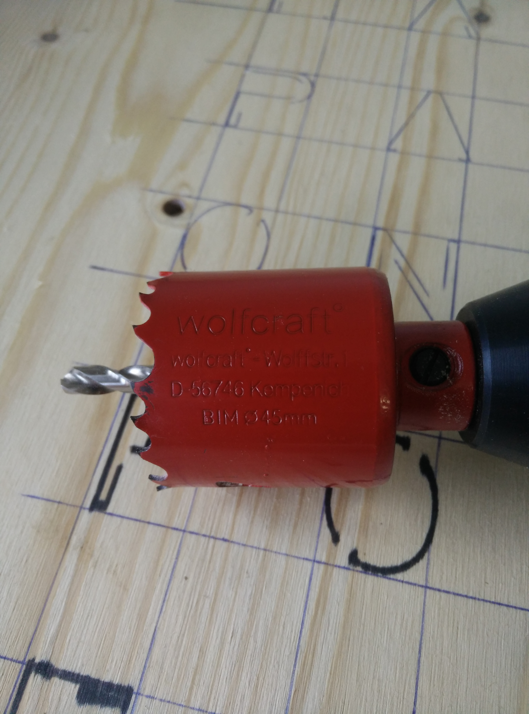
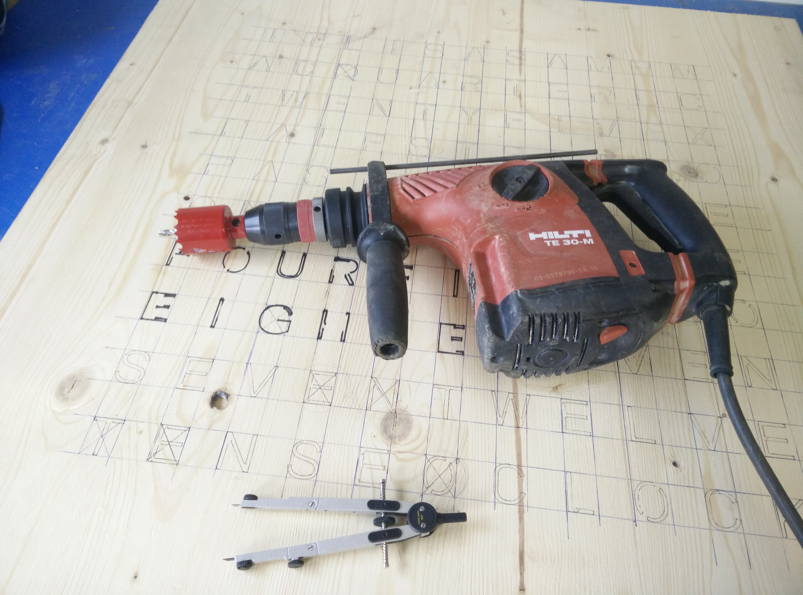
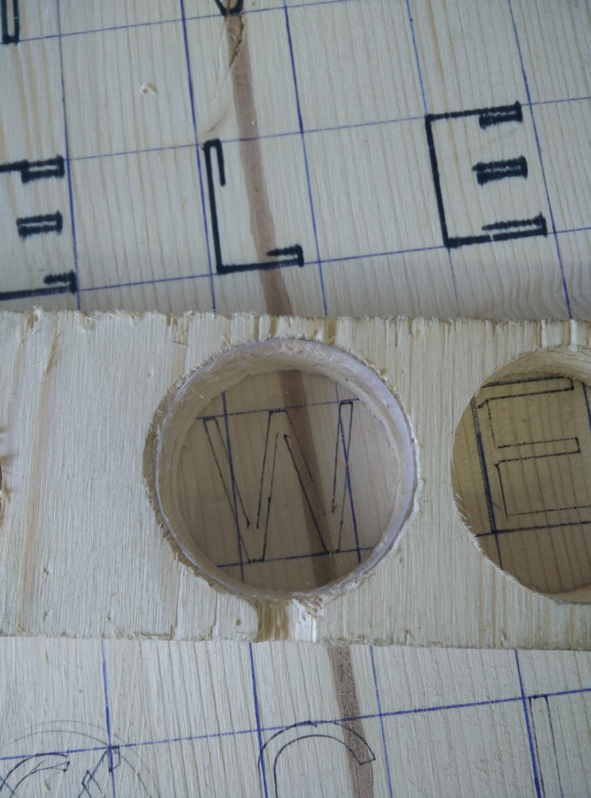
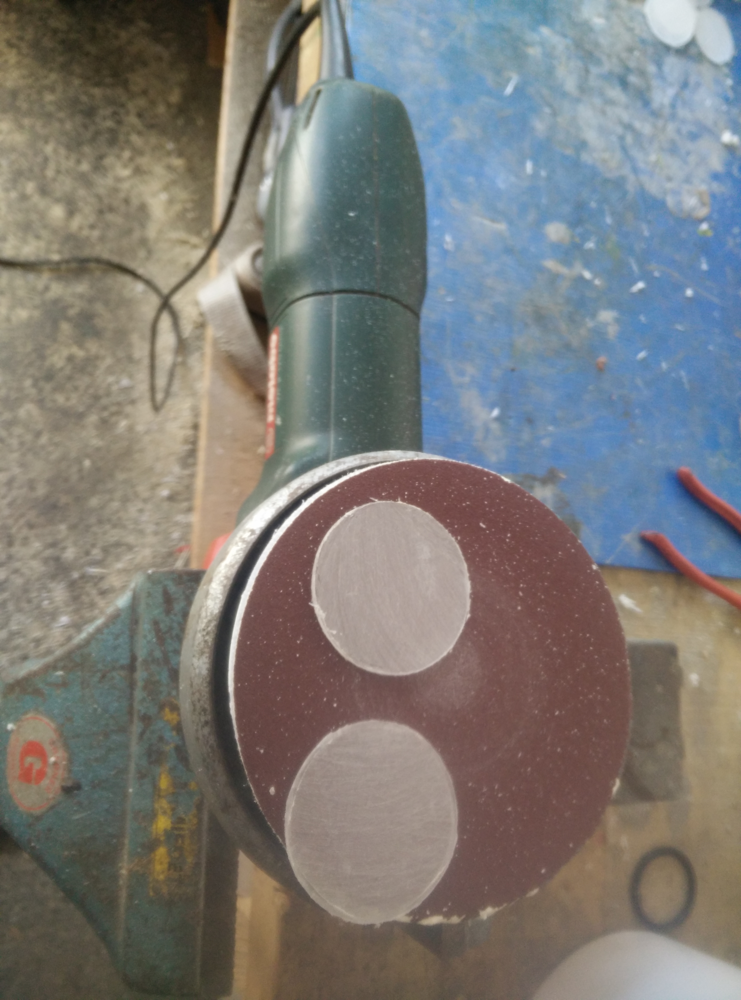

# morgeb

Morgeb, the friendly clock for eachdays morning.
This repository holds all the information to build nice looking word clock on your own.
Currently, it only covers the english version, but it should not be difficult to adopt it to work for other languages like german as well.

The aim of this project was to build a very good looking word clock, therefore we have started with the frontpanel and designed everything else afterwards.
That is the reason, why no LED strip was choosen for lightning.

The clock is 900x900mm in size.

**!!! Image will follow, still in production!!!**

## Housing
This section will hold all the information to build the actual clock case.

### Frontpanel
We have decided to go with a laser cutted metal panel, because it looks way better than some acrylglas front.
Please find all the relevant files within the [frontpanel](./frontpanel) directory.

It includes the [svg](https://developer.mozilla.org/en-US/docs/Web/SVG) source, as well as the [dxf](https://www.autodesk.com/products/autocad/overview) file.
Because [Autocard](https://www.autodesk.com/products/autocad/overview) is very expensive, we have created the front panel layout via [Inkscape](https://inkscape.org/) and finally converted the [svg](https://developer.mozilla.org/en-US/docs/Web/SVG) to [dxf](https://www.autodesk.com/products/autocad/overview).

Because the metal plate weighs around 12kg, we have decided place screws throw the minutes holes, safety first.

Please see below the physically frontpanel which is 900x900mm in size:

Because the front was designed within the [svg](https://developer.mozilla.org/en-US/docs/Web/SVG) format and finally scaled to meet 900x900mm, we had no idea how big the characters will actually be. Furthermore, we have tried to keep each character within a bounded box, but some are misleaded, for example the `W`.

### Woodbody
Because your project is based on the front panel, we had to wait until this part is fabricated. After receiving the front, we copied all the characters to your woodbody. Use a pen, place the wood under the front and start drawing.

Because we had no idea, how big the characters will be, your first task was to find a suiteable hole size. After some measuring and try and error, a 45mm driller turned out to be the tool. The biggest character is the `W`, which fits nicely.

The final hole was a little bit bigger, which was acceptable.

After some time, we have drilled all holes successfully. Because we had no professional workshop, we did some predrilling to meet exactly the middle with the hilti.

### Holeglas
It looks terrible if we simply place the LED behind the metal front.
Therefore, we did some more try and error and finally agreed to use a combination of smoothed acrylglas and frosted glass film.

First we have smoothed the acrylglas with disc grinder.

Afer some more try and error, it turned out to get suiteable circules if we use a 50mm can driller.

**!!! image missing**

Finally, we need to grind everything a bit and magically everything will suite together.

## Hardware

## Software

## FrontPanel
The 

