# morgeb

Morgeb, the friendly clock for eachdays morning.
This repository holds all the information to build a nice looking word clock on your own, without any high expensive equipment (beside the frontpanel).
Currenlty, the repository only includes file to build a english version, however, it should not be difficult to port it to different languages like german.

The goal of this project was to build a nice looking word clock, therefore we have started with the frontpanel and developed everything else based on it. Thus, we were not able to simply use a led strip for lightning.

The clock is 900x900mm in size.

Please find the POC video below:

**!!! Image will follow, still in production!!!**

## Costs
| Name       | Price    |
| ---------- | -------- |
| Frontpanel | 55 Euro  |
| Wood       | 70 Euro  |
| Backplate  | 20 Euro  |
| Leds       | 150 Euro |
| Folio      | 10 Euro  |
| Mic        | 25 Euro  |
| ---------- | -------- |
| Total      | 330 Euro |

## Frontpanel
We have decided to go with a laser cutted metal panel, because it looks way better than some acrylglas front.
Please find all the relevant files within the [frontpanel](./frontpanel) directory.

It includes the [svg](https://developer.mozilla.org/en-US/docs/Web/SVG) source, as well as the [dxf](https://www.autodesk.com/products/autocad/overview) file.
Because [Autocard](https://www.autodesk.com/products/autocad/overview) is very expensive, we have created the front panel layout via [Inkscape](https://inkscape.org/) and finally converted the [svg](https://developer.mozilla.org/en-US/docs/Web/SVG) to [dxf](https://www.autodesk.com/products/autocad/overview).

Because the metal plate weighs around 12kg, we have decided to place screws throw the minutes holes, safety first. The two upper screws will be mounted to nutes, which are welded to another small piece of metal to guarantee safety. The lower two ones are just there for symmetry. 

Please see below the physically frontpanel which is 900x900mm in size:

Because the front was designed within the [svg](https://developer.mozilla.org/en-US/docs/Web/SVG) format and finally scaled to meet 900x900mm, we had no idea how big the characters will actually be. Furthermore, we have tried to keep each character within a bounded box, but some are misleaded, for example the `W`.

To achieve a smooth lightning, have have placed four layers of smoothing folio along the character lines.
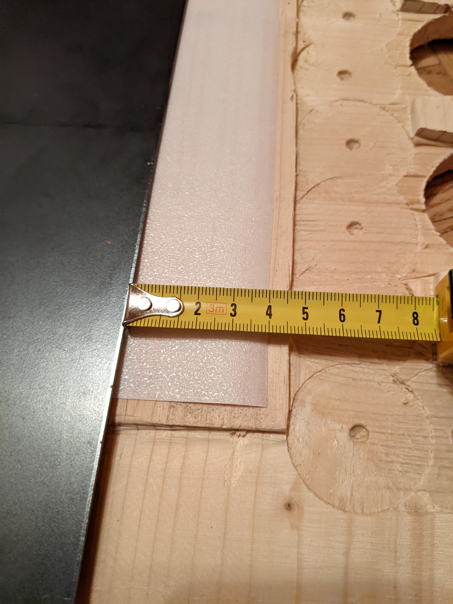
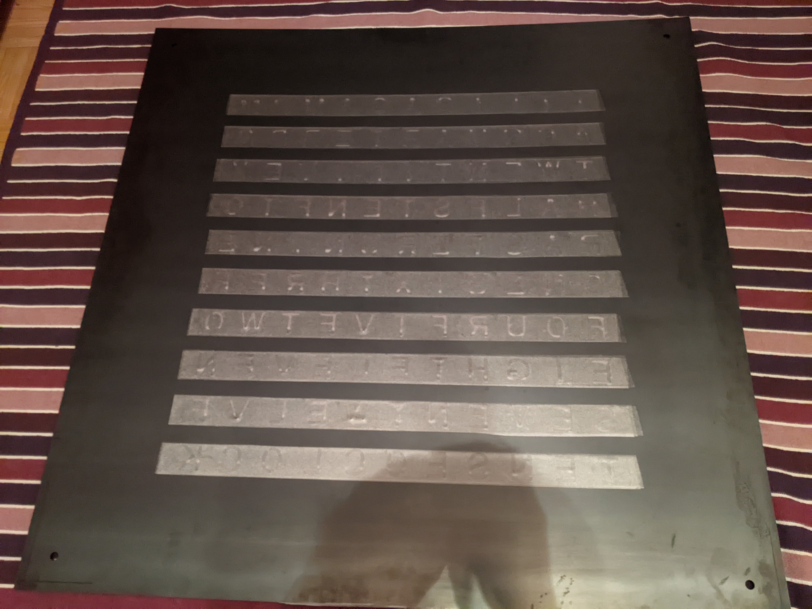

We have picked four layers, because it seems to be a good tradeoff between thickness and light diffusion.

## Woodbody
Because your project is based on the frontpanel, we had to wait until this part is fabricated. After receiving the front, we copied all the characters to your woodbody. Use a pen, place the wood under the front and start drawing.

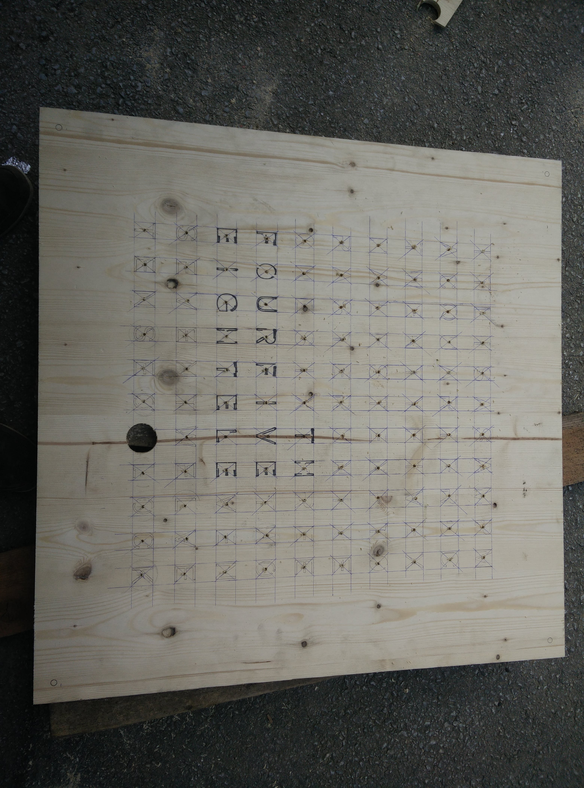

The woodbody is a little bit smaller than the frontpanel, the idea was to make the body invisible by giving the metal a little advance.
It's around 888x888mm in size. Further, we have picked a 27mm thick three layer wood plate. There was no specific reason for it, it was just available to us. But the decision was quite lucky, we need some space between the leds and the frontpanel to achieve a nice lighting and to fix the panel properly, a nut will be mounted into the body, which would be also complicated if the body would be to thin.

Because we had no idea, how big the characters will be, your first task was to find a suiteable hole size. After some measuring and try and error, a 45mm driller turned out to be the tool. The biggest character is the `W`, which fits nicely.

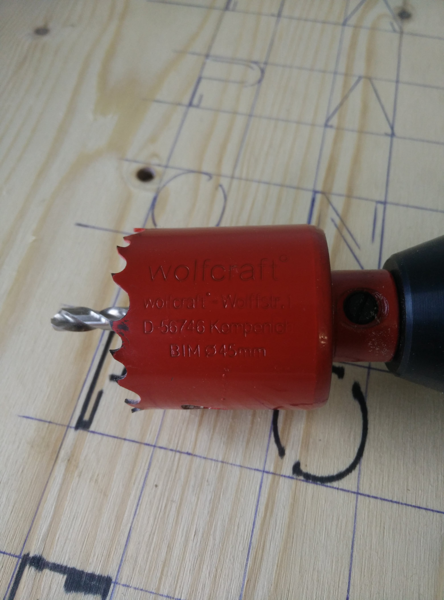

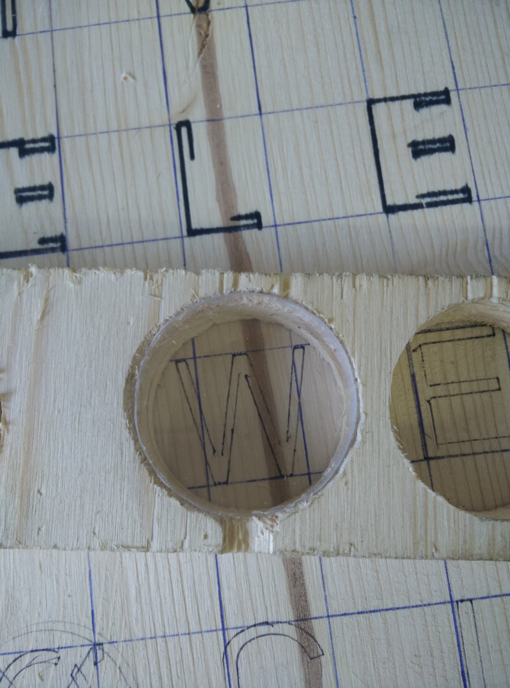

The final hole was a little bit bigger, which was acceptable.
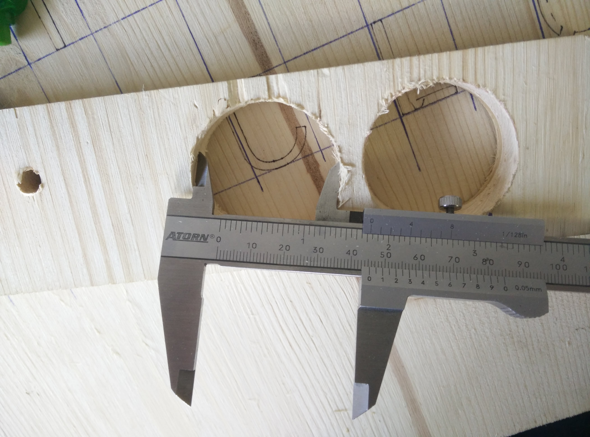

After some time, we have drilled all holes successfully. Because we had no professional workshop, we did some predrilling to meet exactly the middle with the hilti.

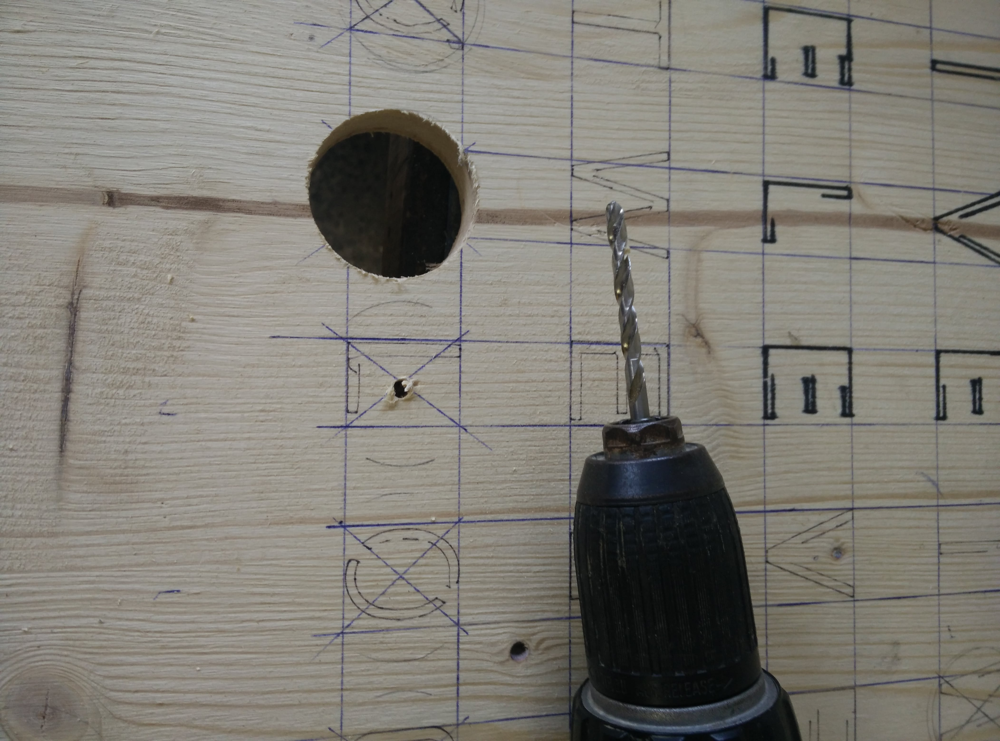
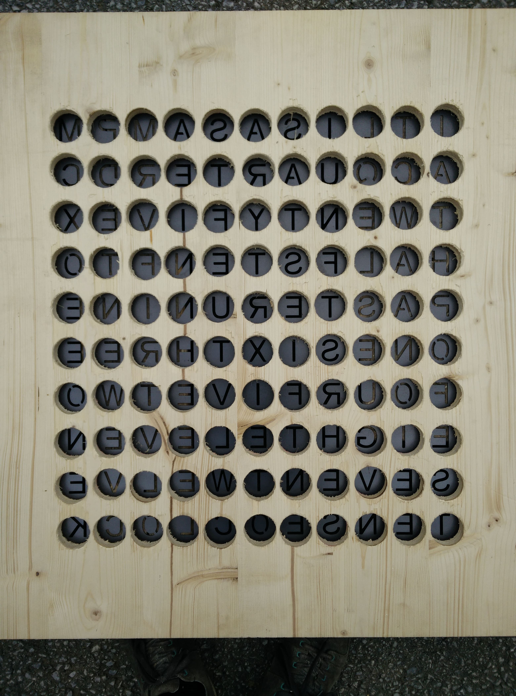

After drilling all the holes, we have smoothed the holes a little bit on both sides. By smoothing the edges, we receive a bigger hole, with reduces the change that some character edges are not well lighted. However, this should not be the case, due to measurement before.
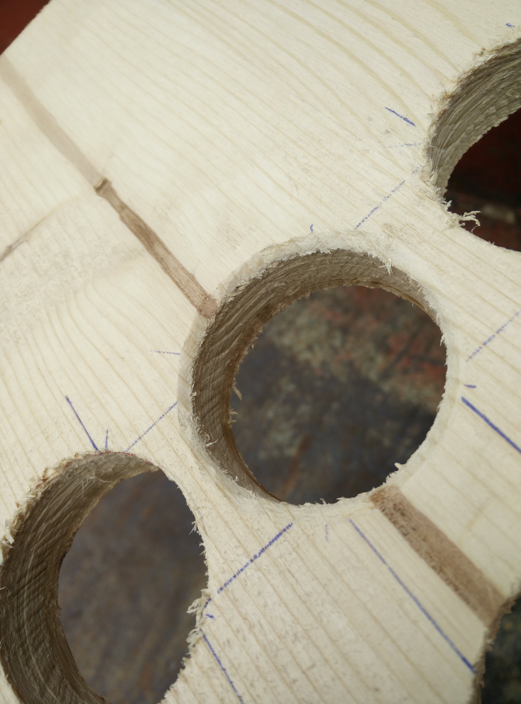

Next, we need to cut out paths for the cabels. We used a 45mm driller and a angle grinder for this task. The result does not look very pretty, but nobody will see it. We simply drilled the first layer away, which was a nice indicated when we had to stop. However, this came with a small downside, small remining pieces tend to break apart easily, so please be careful. Please apologize on the next image, that there is a path on the top, this was an mistake :)

Next, we need to remove 2mm of wood at the top of the body. This allows us to intergrate the metal strip with mounted/welded nuts on it into the wood body. In addition, we have cutted a strip on the right and left side, which will act as mounting point. The idea is that the clock is holded by the metal strip, which is screwed with the frontpanel. Hence, there is no change the the wood will break. To remove the 2mm (metal thickness) from the wood plate, we have used again the angle grinder and a belt sander. 

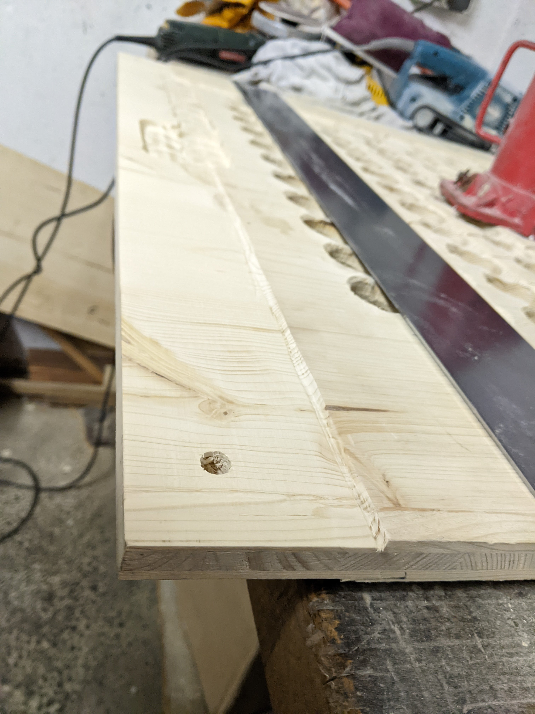
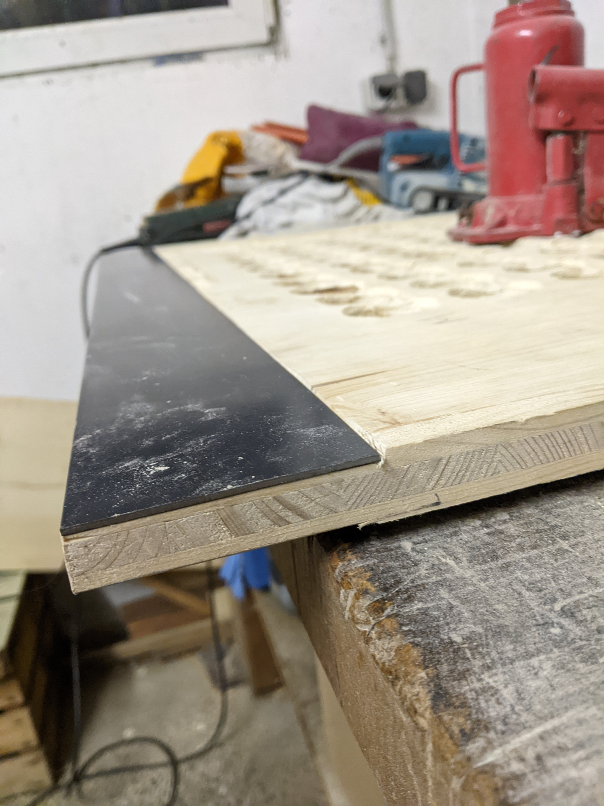

#TODO add some final images

## Backside
Next, we will fabricat the backside with all the leds mounted. This part is the costliest one of the three ones, because we need to do a lot of soldering. We have used a 4mm press board with eight leds for each character. Please feel free to use less than eight leds per character, it's a massiv overkill. Although, four leds have not achieved the expected fluent result, therefore we picked eight. By using eight leds, a lighting power of 50 out of 255 is enought for normal light conditions. 

Simply place the woodbody on the press board and copy the holes to it.
After this, simply cut the led strips and solder everything properly.

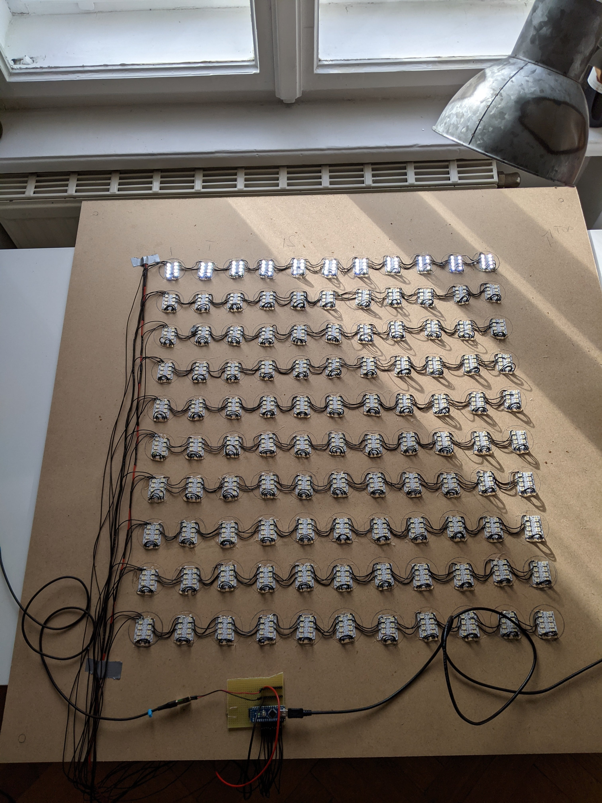

Please ensure to use an big enought cable diameter which supports the current. We have choosen 0.125 which seems to work but is really the lower bound in our opinion. After soldering everything, we have fixed them with hotglue.

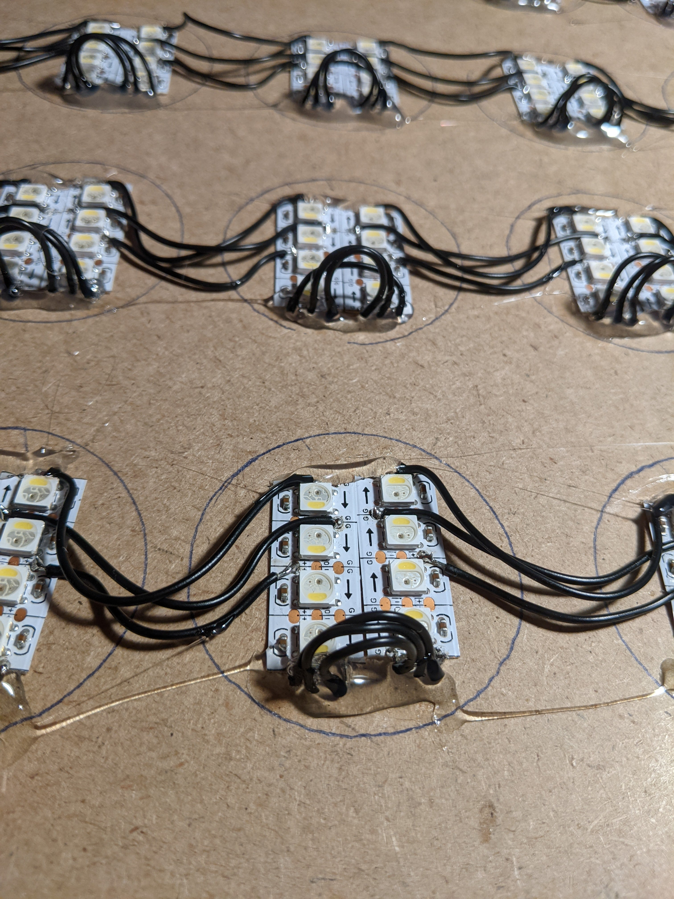

To reduce the cables, we have picked a 1.5mm cable for power and mass and soldered each line to it. In total, we have not ten control cabels plus two more for power and mass. In total, twelve cabels which go to the controller.

## Controller
For the controller, we have picked an [AtMega382p](http://ww1.microchip.com/downloads/en/DeviceDoc/Atmel-7810-Automotive-Microcontrollers-ATmega328P_Datasheet.pdf) in combination with a [DS3231](https://datasheets.maximintegrated.com/en/ds/DS3231.pdf) RTC.

## Software
Please checkout the [code](./code) directory.

 -->
