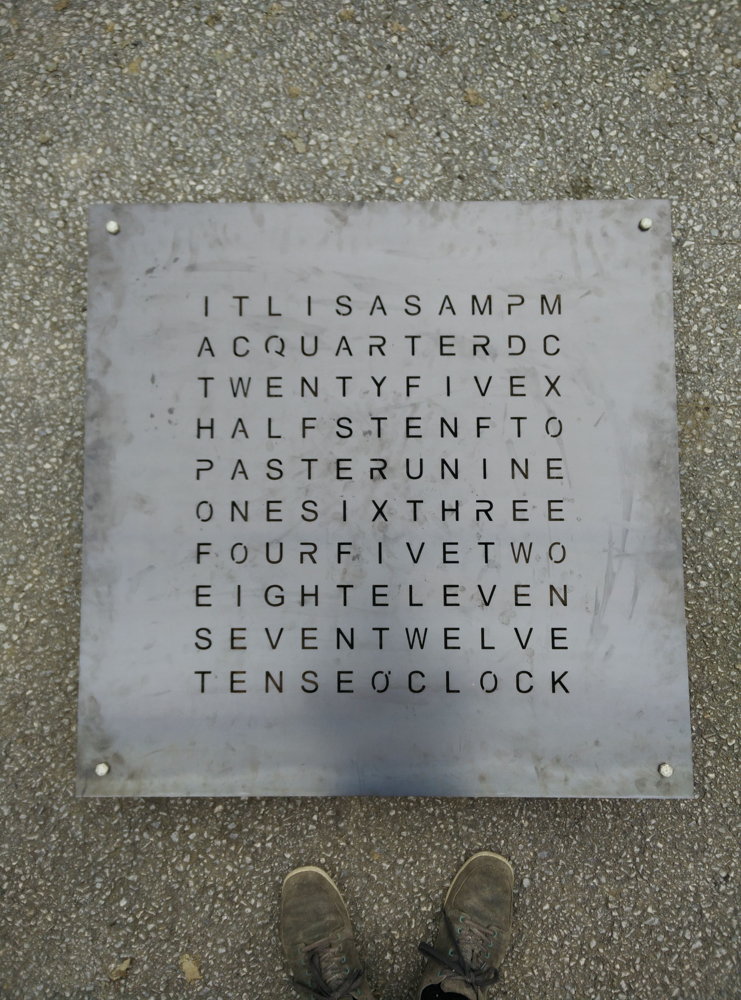

# Morgeb - Unauthorized word-clock replica

**Morgeb** - the friendly word clock for every day's morning. This project should be a guideline for building your customized word clock. It contains the code and the manufacturing steps for my own version of the word clock, as shown below. The clock is 900x900 mm in size and weighs approximately 24 kg. The front is entirely rusted and looks terrific.

The primary goal of this project was to design and manufacture a nice-looking word clock without the need for expensive equipment and with common tools. Additionally, it should be giant and straightforward to build. The current repository version only covers the English layout. However, porting to other languages should be straightforward and only requires reordering the characters and redefining their location in the C-Header file.

# Costs
| Name       | Price    |
| ---------- | -------- |
| Frontpanel | 55 Euro  |
| Wood       | 70 Euro  |
| Backplate  | 20 Euro  |
| LEDs       | 150 Euro |
| Extra stuff| 10 Euro  |
| Mic        | 25 Euro  |
| ---------- | -------- |
| Total      | 330 Euro |

The clock cost me around 330 euros, which is not that cheap. But as we can see in the cost table, the LEDs cost the most, and this position can be easily reduced. As a spoiler, I have used eight controllable LEDs (NeoPixels) per character, which results in 880 LEDs in total. This amount is ridiculously high, and using half or just a quarter of them should be enough to achieve the same result.

# Manufacturing
Let's get started to step over each manufacturing step. The clock consists of the following four main parts, which we will now introduced:
* Front panel
* Wood body
* Backside
* Controller

## Front Panel
We have decided to make the front out of metal and let it rust. Therefore, we have designed the layout via the open source tool [Inkscape](https://inkscape.org/) and exported a [SVG](https://developer.mozilla.org/en-US/docs/Web/SVG) source, as well as the [DXF](https://www.autodesk.com/products/autocad/overview) file, stored inside the `frontpanel` directory. A friend of mine has access to a laser cutter machine, which accepts the DXF file. The final 900x900 mm metal plane is shown in the image below:

Because the plate weights approximately 12 kg, we placed four screws through the holds of the edges to secure the plate, instead of showing the minutes. If your clue, which mounts the panel to the later explained wood body, is strong enough, these screws should not be needed. I have used the [FixAll](https://www.soudal.de/diy/produkte/fix-all/fix-all/fix-all-high-tack#v12190) clue, which is for sure strong enough, but for safety reasons, the screws are there, and I think they give the clock a real badass touch. 

After laser cutting the metal, there is little to do. Rusting takes time; if you prefer, you can try one of these fast rust products. They have not worked for me, so I have waited one year until it was done. However, I have removed the cinder via a grinder before letting it rust.

Finally, I have clued strips of simple white bakery paper over the characters to defuse the light nicely. Unfortunately, the stips have not held as good as hoped. 

Therefore, I used some hot glue after mounting the wood body to fix the bakery strips one more time.
I have used three layers of bakery paper to gain a lovely diffusion.

## Wood Body
The size of the wood body is a little bit smaller, approximately 888x888 mm, which gives the front panel some advance. The idea was to make the body invisible and let the front panel fly. Furthermore, the selected plate is a 27mm thick three-layer wood plate, which was available to me. But the decision was quite lucky because it is thick enough to achieve nice lighting and properly fix the front. 

Because the clock size was selected arbitrarily, and we had no idea how big the characters would be, there was no real guide on manufacturing the wood body. So, we started copying each character from the front panel to the wood and used try-and-error to find the perfect driller size. Finally, we picked a 45mm driller because the resulting hole was big enough to fit all characters and keep enough space between each hole for clueing the front panel. We used the `W` to measure if all symbols match because it is the biggest.
To perfectly center the 45 mm hole, we used a smaller driller in a preprocessing step to meet the middle later.

Finally, we smoothed the edges of each hole a bit. This process enlarges the hole size even more and prevents some edges of a character are not lighted up and remaining dark later. Additionally, we removed a little bit of wood between the holes in each horizontal lane. This path is later used by the cables connecting the LEDs from each character.

Next, we need to remove 2mm of wood at the top of the body. This allows us to integrate the metal strip with mounted/welded nuts into the wood body. In addition, we have cutted a strip on the right and left side, which will act as a mounting point. The idea is that the clock is held by the metal strip, which is screwed together with the front panel. Hence, there is no chance that the wood will break. We have used the angle grinder and a belt sander to remove the 2mm (metal thickness) from the wood plate. 

Next, we need to cut out paths for the cables and the microcontroller. We used a 45mm driller and an angle grinder for this task. The result does not look very pretty, but nobody will see it. We simply drilled the first layer away, which indicated when we had to stop. However, this came with a small downside, small remaining pieces tend to break apart easily, so please be careful. Please apologize for the next image, that there is a path on the top. This was a mistake :)
Finally, we painted the body and we were done.

## Backside
Now, we will fabricate the backside with all the LEDs mounted. This part is the costliest one of the three ones because we need to do a lot of soldering. We have used a 4 mm press board with eight LEDs per character. Please feel free to use less than eight LEDs per character; it's a massive overkill. We have used 5050 SK6812 RGBW LEDs which are powered via 5V. 

Simply place the wood body on the pressboard and copy over the holes. After this, cut the LED strips and solder everything together.

Please ensure to use a big enough cable diameter that supports the current. We have chosen 0.125, which works but is the lower bound. After soldering everything, we fixed everything with hot glue.

To reduce the cables, we picked a 1.5mm cable for power and mass and soldered each line to it. In total, we ended up with ten control cables plus two for power. In total, twelve cables going to the controller.
Finally, we colored the pressboard also white and the back board is done. The plate is mounted to the wood body with simple screws.

## Controller
For the controller, we have picked an [AtMega382p](http://ww1.microchip.com/downloads/en/DeviceDoc/Atmel-7810-Automotive-Microcontrollers-ATmega328P_Datasheet.pdf) in combination with a [DS3231](https://datasheets.maximintegrated.com/en/ds/DS3231.pdf) RTC. The design is chosen so that it fits perfectly into the prepared hole. Additionally, added a photoresistor to adjust the LED brightness depending on the ambient light level. The resistor, together with the power cable, is exposed through a small cutout.

## Software
Please checkout the [code](./code) directory.

## Pictures
Because picture explain more than 1000 words, here some one from the final product.

